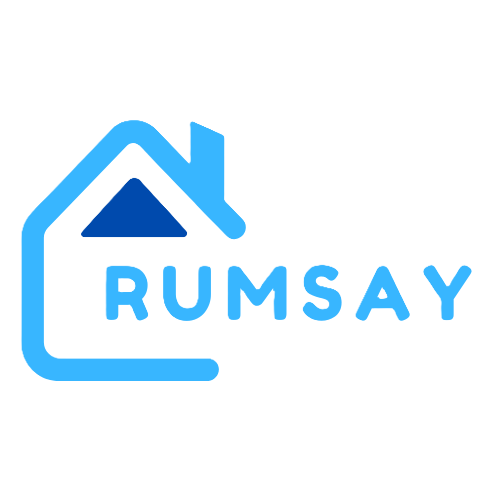

<div align="center">
  
  
  <h1 align="center" style="font-size:3rem; font-family:'Poppins',sans-serif; letter-spacing:2px; color:#3b82f6;">RUMSAY HOTEL</h1>
  <p align="center" style="font-size:1.2rem; color:#64748b;">Gen Z's favorite place to stay, vibe, and book rooms online.</p>
  <p align="center">
    
    
    
    
  </p>
</div>

---

# ✨ Rumsay Hotel Client (React + Vite)

> **Where luxury meets Gen Z energy.**

Rumsay Hotel Client is a modern, aesthetic hotel booking web app built for the next generation. Book, vibe, and manage your stay with a few clicks. Designed for mobile and desktop, with a playful, bold, and colorful interface.

---

## 🚀 Features

- 🏠 **Trendy Homepage**: Hotel highlights, amenities, and a vibrant gallery.
- 🔎 **Room Booking**: Filter by type, price, and amenities. Find your perfect vibe.
- 🛏️ **Room Details**: Scrollable, image-rich, TikTok-style room previews.
- 👤 **User Auth**: Sign up, sign in, and manage your Gen Z profile.
- 🗂️ **Profile Dashboard**: See your bookings, edit your info, and flex your stays.
- 🛠️ **Admin Dashboard**: Manage rooms, users, and reservations (for staff).
- 💸 **Stripe Payments**: Secure, fast, and easy online payments.
- 📱 **Responsive**: Looks fire on any device.

---

## 🛠️ Tech Stack

- **Frontend**: React 19, Vite, Tailwind CSS
- **Routing**: React Router DOM
- **State**: React Hooks
- **Forms**: Formik, Yup
- **HTTP**: Axios
- **UI**: Flowbite React, Lucide React, React Icons
- **Dates**: date-fns, react-datepicker
- **Payments**: Stripe.js, @stripe/react-stripe-js
- **Linting**: ESLint

---

## ⚡ Getting Started

### Prerequisites

- Node.js (v18+)
- npm or yarn

### Installation

```sh
# 1. Clone the repo
 git clone <your-repo-url>
 cd Rumsay-ClientSide

# 2. Install dependencies
 npm install
# or
yarn install

# 3. Add your .env
VITE_BASE_URL=https://your-api-url.com
VITE_STRIPE_PUBLIC_KEY=pk_test_...

# 4. Start the dev server
npm run dev
# or
yarn dev
```

Open [http://localhost:5173](http://localhost:5173) and start vibing!

---

## 📁 Project Structure

```
src/
  components/   # Navbar, Footer, Gallery, Payment, etc.
  pages/        # Homepage, About, Booking, Profile, Admin, etc.
  assets/       # Images and static assets
  service/      # Utility services (e.g., image upload)
public/         # Static files
App.jsx         # Main app entry with routing
main.jsx        # React root
```

---

## 🧑‍💻 Scripts

- `npm run dev` — Start dev server
- `npm run build` — Build for production
- `npm run preview` — Preview production build
- `npm run lint` — Run ESLint

---

## 🦄 License & Credits

Power by <b>RUMSAY Team</b> | For learning & vibes only.

---

<p align="center" style="color:#3b82f6; font-size:1.1rem; font-family:'Poppins',sans-serif;">✨ Stay. Vibe. Repeat. ✨</p>
